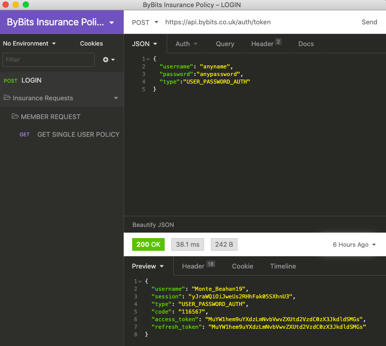

# byMiles Code Challenge🤔 :

## Table of Contents 📖

- [Overview](#overview-)
- [Technologies](#technologies-)
- [Planning](#process-)
- [Getting Started](#getting-started-)
- [Future Work](#future-work-)

## Overview 👓

A simple, **web application** that **returns information** about the **user's insurance policy** once **logged in**.

The **API** which contains the **insurance policy information** has been **provided** to help with the task. The **technical stack** has **not been specified** and I was free to choose what I am most comfortable in.

In total, the task took around **5hrs**. Though some of this was attributed to **trying to learn** more about **Test Driven Development** and figuring out how to **apply certain testing technniques** to this challenge. In the end, rather than trying to write tests which I am **not experienced in**, I have **listed out the tests** that I would have carried out if given more time and practice, in the **'Future Work'** section below.

## Technologies 💻

- General:
    - **HTML5**
    - **CSS3**
    - **Sass**
    - **React**
- Others:
    - **GitHub**
- 3rd party packages:
    - **Axios**

## Process 📝
- I started by **testing** how to use the **provided API** using a tool called **Insomnia**, and seeing **how the request is sent** and **what data is returned** in the **response**.

- I then decided on the **tech. stack** I was going to use for this challenge. This was based on my **experience** which was focused on **React (Front-End)**.

- Next, I started on building the **Front-End components** (i.e. the **'Sign In' form**, the **'Policy' page**). The **initial design** was based on the **provided wireframe**.

- After **completing** the **Front-End components**, I moved on to **setting up** the **API requests** and **handling** and **presenting** the **response data**.

- I also added a functionality to **disable** the **'Sign in' button** should there be **no inputs** for the **'Username'** and **'Password'** fields. This acts as a **basic form validation**.

### MVP
- **GitHub repository** containing **project code**
- **Readme document** containing **thought processes** and **any assumptions made**
- **Estimation of time** spent
- A **simple**, **web application** which takes a **'username' and 'password'**, upon **successful log in**, **'insurance policy' information** is **returned** and **presented** to the **user** on the application

## Getting Started 🏃‍♂️🏃‍♀️

If you wish to **run it locally**, you will need to **follow the steps below**:

- **Fork** or **Clone** the **GitHub repository** ([https://github.com/tams2429/byMiles](https://github.com/tams2429/byMiles)),
- In the root project folder, run `npm install` to **install** all **dependencies**,
- `npm start` to **start the development server** for the **whole application**,

## Future Work ☕
### Tests
As mentioned, I didn't feel comfortable/experienced enough to be writing tests (i.e. **unit tests**) but if given **more time** and **practice** I would have liked to **incorporate the following tests** and **concepts** with the help of **Jest** and **Enzyme**:
- **Test Driven Development** = Writing **tests** that describe what I **expect to see** (i.e. **failing first**) and then building components around that
- **Tests** to check that the **API** has been **successfully called** and a **response sent**, by testing whether the **values** in **'State'** are what I would **expect**, this could be in the form of the **'Data Type'** but since this API returns **'Dummy Data'** then I can test the **'Exact value'** in the **'State'**
- '**Simulate' clicking 'Sign in' button** and whether it **changes to next page**,

### Assumptions
- In reality, it is assumed that only **registered users** with have information attributed to their **insurance policy**. As a result, even if users are able to go straight to the 'Policy' page with the **URL path '/policy'** there will be **no information** as the **API request will fail**. As a result, I have **not** deemed it **necessary** to make the **'Policy' page**, a **'Private route'**.

